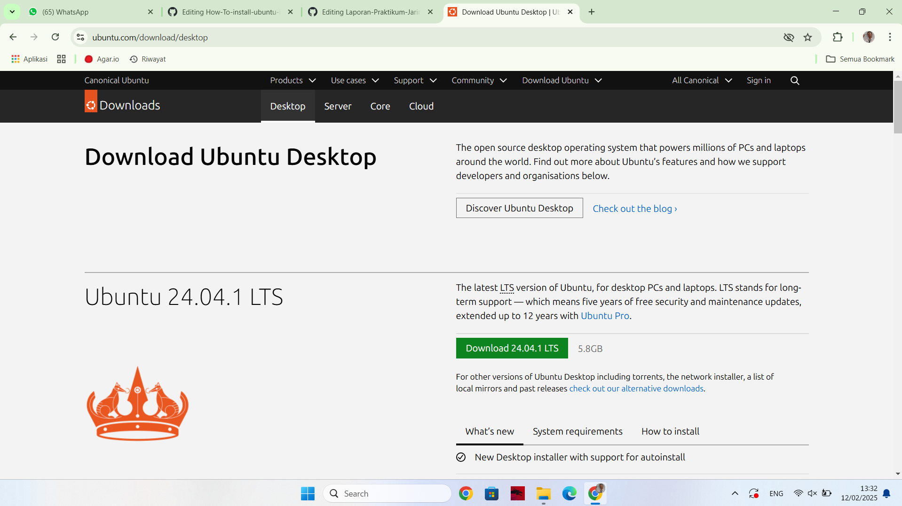
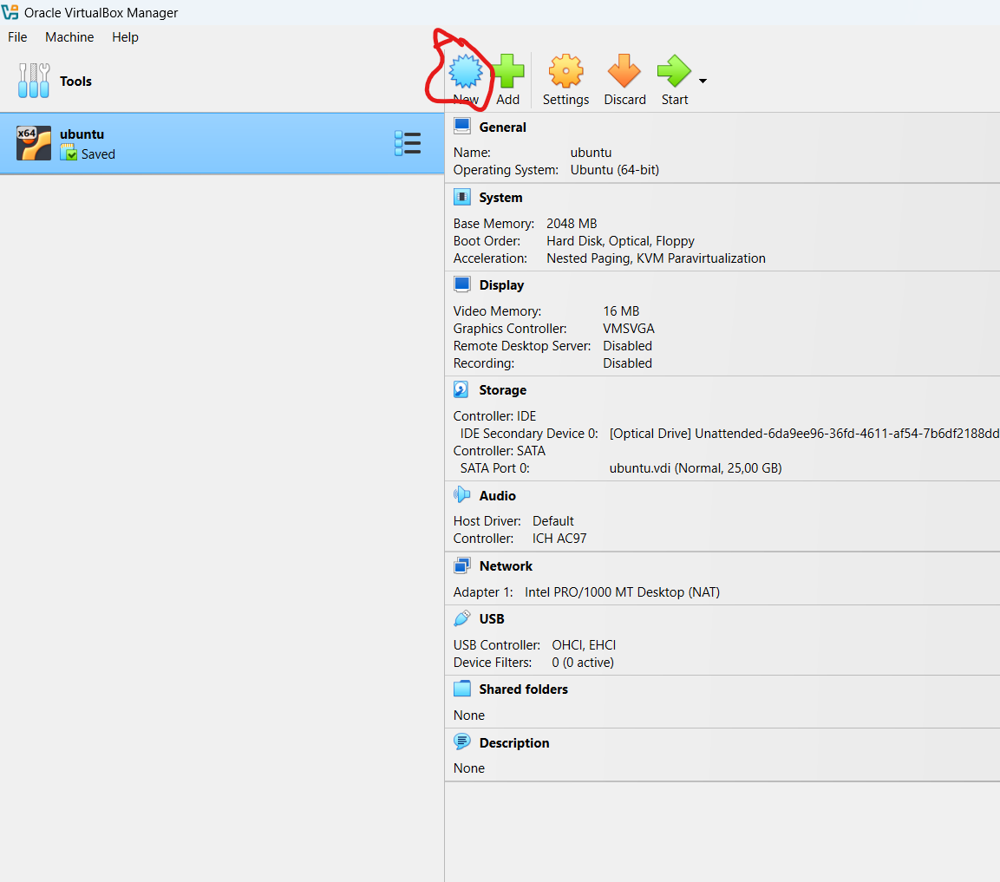
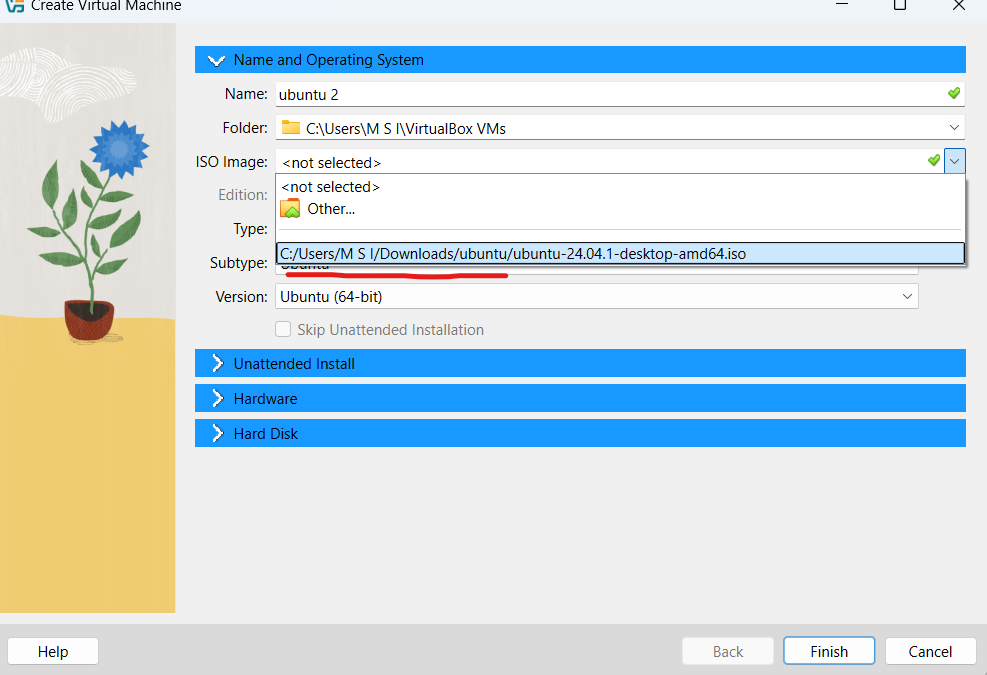
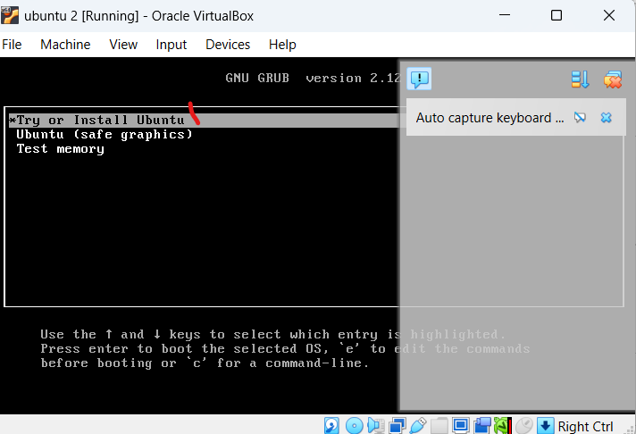
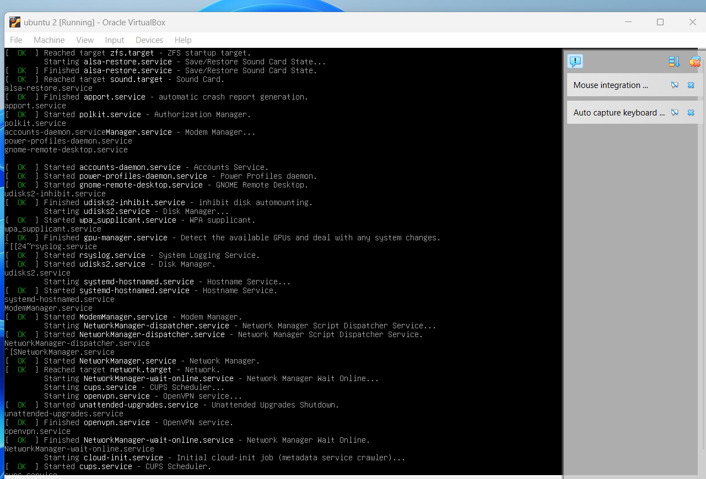
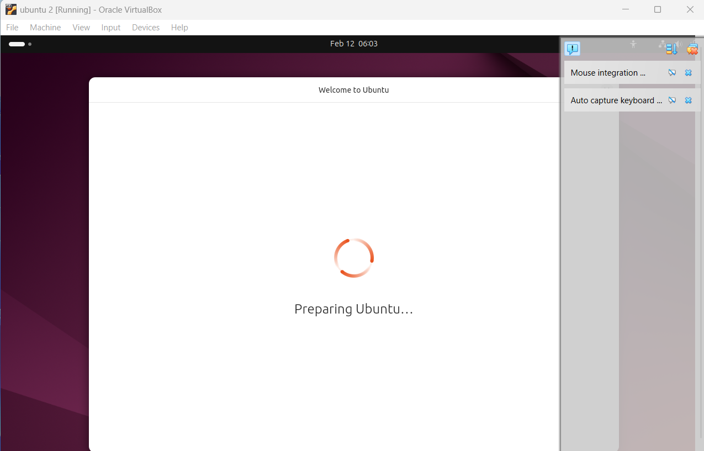
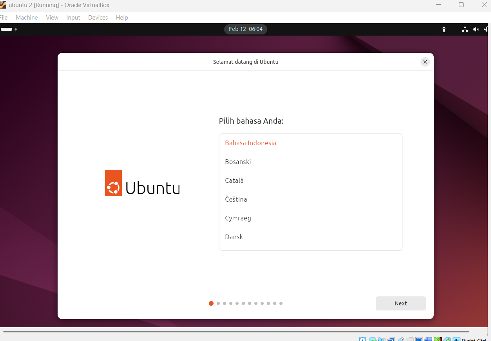

# How To install ubuntu in oracle virtual box
NAMA : M WALID FARHAN

NIM  : 09030282327039

Mapel: Sisten Operasi

Selamat datang di github saya, pada blog ini saya hanya akan menuliskan dan menjelaskan laporan sistem operasi apa saja yang telah saya pelajarin di kampus. pada saat ini saya akan membagikan turtorial bagaimana cara menginstall Ubuntu di windows menggunakan virtual box. sebelum masuk ke turtorial saya akan menjelaskan apa itu ubuntu, Ubuntu adalah sistem operasi berbasis Linux yang digunakan untuk berbagai keperluan, seperti pengembangan perangkat lunak, pengembangan server, dan cloud computing. Ubuntu populer di kalangan pengguna Linux karena mudah digunakan dan diinstal.

# Berikut bagaimana cara menginstall ubuntu di virtual box.
- pergi ke website ( https://ubuntu.com/download/desktop )

  
- Ingat kalian perlu Oracle Virtual Box.
- Bukak Virtual box > klik new

   
- Berinama UBUNTU selanjutnya pergi cari file ubuntu yang sebelumnya di unduh

  
- selanjutnya tunggu sampai muncul pilihan Try Install Ubuntu > tunggu .
  
   
- Selanjutnya ketika tampilan sudah seperti ini, tunggu sebentar hingga muncul pilihan Bahasa, pilih bahasa indonesia.

       
- Jika sudah muncul deskop ubuntu berarti telah selesai

  

  Terima Kasihhhh
  
